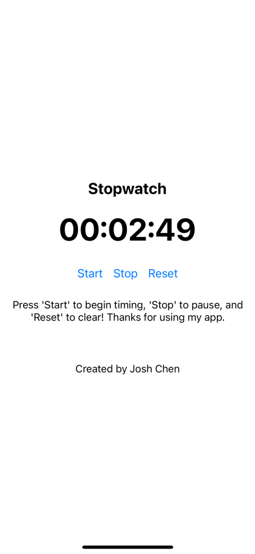

# Changes Made

1. Updated App.tsx to import my Stopwatch file
2. Updated the Readme to include a demo image, and the stop watch clearly working.
3. Updated Stopwatch.tsx to display a basic stopwatch with HRs, Mins, Secs on it. Text was adding was well as custom styling for the app. 
4. Updated StopwatchButton.tsx to have three buttons, for stopping, starting, and resetting the timer! Adds lap functionality as well!

## Usage

To use, simply run:

1. npm install 

2. expo start

3. Download Expo app on your iPhone, then scan the QR code that shows up in Visual Studio Code. Make sure to install NodeJS and the relevant VSC linting tools. 

4. It runs! View the stopwatch below, and have fun coding! 

## Resources
Here are some resources that may be helpful during your work on this project:

- [TypeScript Documentation](https://www.typescriptlang.org/docs/) - Official documentation for TypeScript, offering guidance on TypeScript features and usage.

- [React Testing Library](https://testing-library.com/docs/react-testing-library/intro/) - Explore React Testing Library, a popular testing library for React applications.
